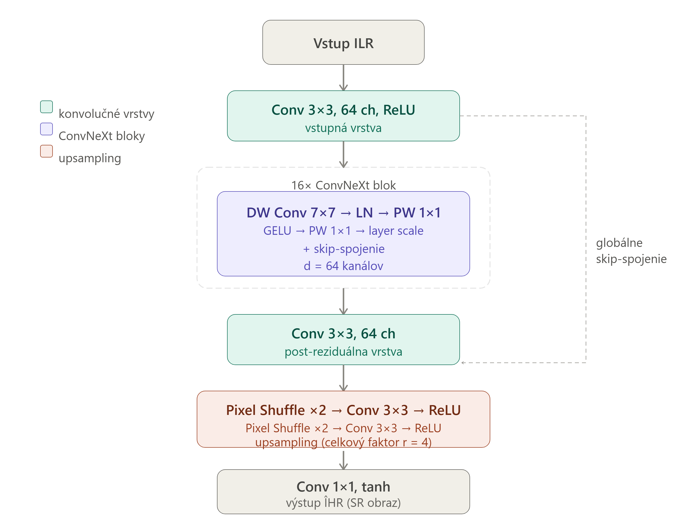
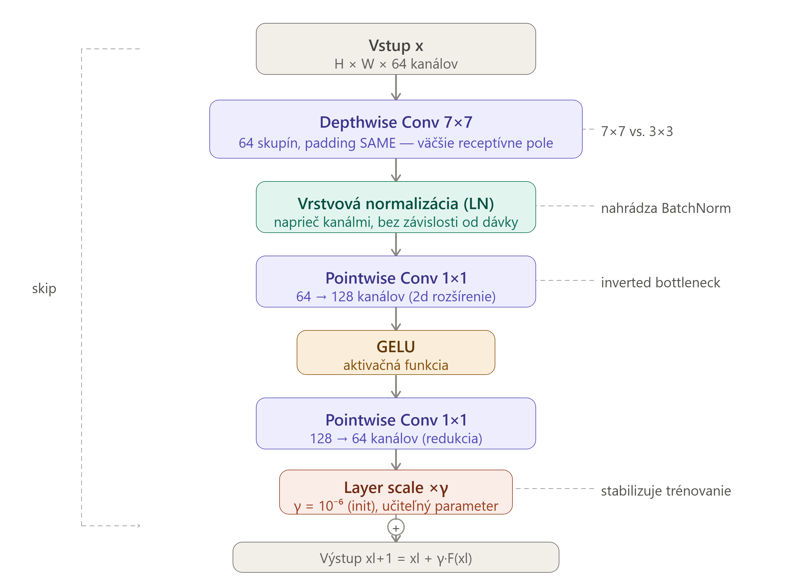
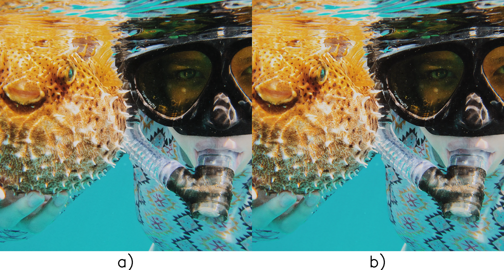
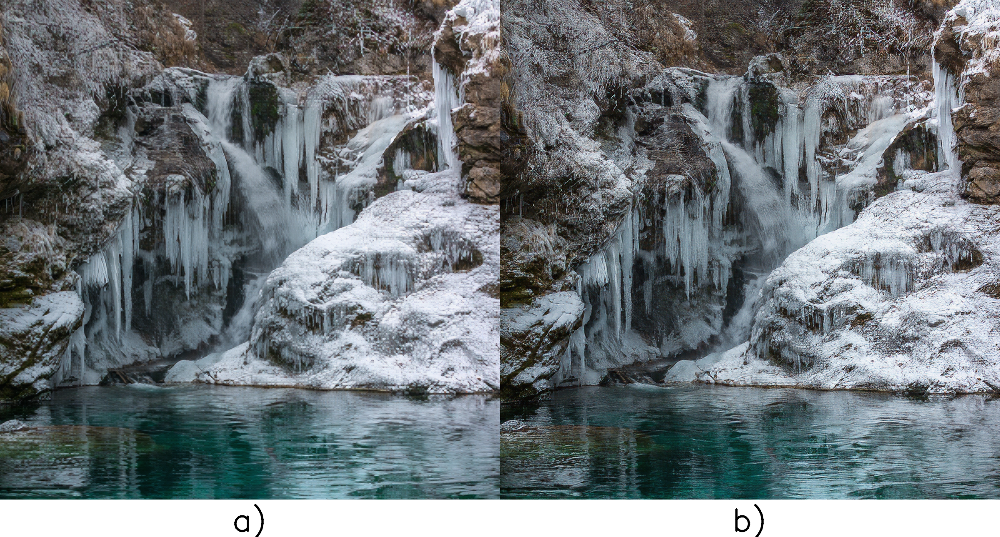
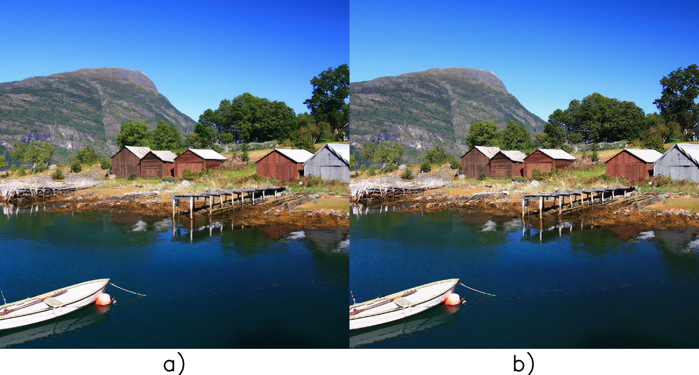

# Image Super-Resolution with ConvNeXt-SRGAN

Implementation accompanying my master's thesis **“Zvýšenie rozlíšenia a rekonštrukcia obrazu pomocou generatívnych neurónových sietí”** (*Image Super-Resolution and Reconstruction Using Generative Neural Networks*).

The project is based on the TensorLayer/TensorLayerX implementation of **SRGAN** and explores a modified generator in which the original SRGAN residual blocks are replaced by **ConvNeXt-style blocks**.

## Overview

The repository contains the code used to train and evaluate a 4× single-image super-resolution model on the **DIV2K** dataset.

The main ConvNeXt-SRGAN generator uses:

- 16 ConvNeXt-style blocks
- 7×7 depthwise convolutions
- Layer Normalization
- 1×1 pointwise convolutions
- GELU activation
- Layer Scale
- two PixelShuffle ×2 upsampling stages
- VGG19 perceptual features during adversarial training

The implementation uses **TensorLayerX with the TensorFlow backend**.

## Architecture

The proposed ConvNeXt-SRGAN generator replaces the residual blocks of the
reference SRGAN generator with ConvNeXt-style blocks while preserving the
overall super-resolution pipeline.

<p align="center">
  
  <br>
  <em>Architecture of the proposed ConvNeXt-SRGAN generator.</em>
</p>

The generator processes a low-resolution input image through an initial
convolutional layer followed by 16 ConvNeXt blocks. A global skip connection
is used around the main feature extraction stage. Two Pixel Shuffle
upsampling stages increase the spatial resolution by a total factor of ×4.

### ConvNeXt Block

Each ConvNeXt block consists of a 7×7 depthwise convolution, Layer
Normalization, two 1×1 pointwise convolutions with GELU activation, Layer
Scale, and a residual connection.

<p align="center">
  
  <br>
  <em>Detailed architecture of the ConvNeXt block used in the generator.</em>
</p>

## Environment

The original experiments were performed with:

- Python 3.9.13
- TensorFlow 2.20.0
- TensorLayerX 0.5.8
- NumPy 1.26.4
- OpenCV 4.11.0
- scikit-image 0.24.0

Install the required packages with:

```bash
pip install -r requirements.txt
```

### Recommended virtual environment

Linux/macOS:

```bash
python3.9 -m venv .venv
source .venv/bin/activate
python -m pip install --upgrade pip
pip install -r requirements.txt
```

Windows:

```powershell
py -3.9 -m venv .venv
.venv\Scripts\activate
python -m pip install --upgrade pip
pip install -r requirements.txt
```

## Project structure

```text
master-s-thesis/
├── src/
│   ├── config.py
│   ├── srgan_convnext.py
│   ├── train.py
│   └── vgg.py
│
├── data/
│   └── DIV2K/
│       ├── DIV2K_train_HR/
│       ├── DIV2K_train_LR_bicubic/
│       │   └── X4/
│       ├── DIV2K_valid_HR/
│       └── DIV2K_valid_LR_bicubic/
│           └── X4/
│
├── model/
│   └── vgg19.npy
│
├── requirements.txt
├── LICENSE
└── README.md
```

The `data/`, `model/vgg19.npy`, trained checkpoints and generated outputs are intentionally not stored in the Git repository because of their size.

## DIV2K dataset

The model was trained using the **DIV2K** dataset with ×4 bicubic downscaling.

The paths expected by `src/config.py` are:

```text
data/DIV2K/DIV2K_train_HR/
data/DIV2K/DIV2K_train_LR_bicubic/X4/
data/DIV2K/DIV2K_valid_HR/
data/DIV2K/DIV2K_valid_LR_bicubic/X4/
```

DIV2K download links are available in the original TensorLayer SRGAN repository:

https://github.com/tensorlayer/SRGAN

## VGG19 pretrained model

VGG19 is used to extract perceptual features during SRGAN training.

The pretrained `vgg19.npy` file is not included in this repository because it is approximately 549 MB.

It can be obtained from the **Prepare Data and Pre-trained VGG** section of the original TensorLayer SRGAN repository:

https://github.com/tensorlayer/SRGAN

Place the downloaded file here:

```text
model/vgg19.npy
```

The included `src/vgg.py` is also capable of downloading the pretrained VGG19 weights when `pretrained=True`, provided the upstream download source is available.

## Training

Run commands from the root directory of the repository.

Start training with:

```bash
python src/train.py --mode=train
```

The training consists of two stages:

1. generator initialization using pixel-wise MSE loss
2. adversarial training using pixel loss, VGG perceptual loss and GAN loss

The configuration used for the thesis includes:

```text
Initial generator training: 100 epochs
Adversarial training:       2000 epochs
Training HR crop:           384 × 384
Training LR crop:            96 × 96
Upscaling factor:             4×
```

Dataset paths and the main training parameters can be changed in:

```text
src/config.py
```

> **GPU note:** the original experiments were performed on a CUDA-capable GPU. If `src/train.py` contains a fixed `CUDA_VISIBLE_DEVICES` value, change or remove it according to your machine before running the training script.

## Evaluation

To run the evaluation mode:

```bash
python src/train.py --mode=eval
```

The evaluation code loads the trained generator weights and generates a 4× super-resolved image.

The thesis evaluates the models using **PSNR**, **SSIM**, and visual comparison.

## Visual Results

The following examples provide a qualitative comparison of the reconstructed
images produced by the reference SRGAN and the proposed ConvNeXt-SRGAN
generator.

In each comparison:

- **a)** Reference SRGAN
- **b)** ConvNeXt-SRGAN

<p align="center">
  
</p>

<p align="center">
  
</p>

<p align="center">
  
</p>

## Thesis

This repository contains the implementation developed for my master's thesis:

**Roman Rapco — “Zvýšenie rozlíšenia a rekonštrukcia obrazu pomocou generatívnych neurónových sietí”**

Pavol Jozef Šafárik University in Košice, Institute of Computer Science.

**Thesis:** [Image Super-Resolution and Reconstruction Using Generative Neural Networks](https://opac.crzp.sk/?fn=detailBiblioFormChildQ6ALH&sid=7F669382AC00D013D59DE75C621E&seo=CRZP-detail-kniha)

## Acknowledgements

This work builds on the open-source TensorLayer SRGAN implementation:

https://github.com/tensorlayer/SRGAN

The original SRGAN method was introduced in:

> Christian Ledig et al., *Photo-Realistic Single Image Super-Resolution Using a Generative Adversarial Network*, CVPR 2017.

The ConvNeXt architecture was introduced in:

> Zhuang Liu et al., *A ConvNet for the 2020s*, CVPR 2022.

## License

Parts of this project are based on or adapted from the TensorLayer SRGAN implementation. The upstream repository states that its implementation is provided for **academic and non-commercial use only**.

Accordingly, this repository is also provided for academic and non-commercial research and educational purposes. See the `LICENSE` file for details.

When using code derived from the original TensorLayer SRGAN project, please also respect the upstream project's licensing terms.
